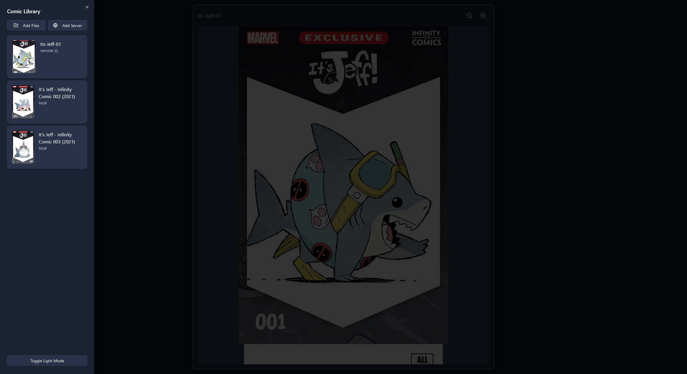
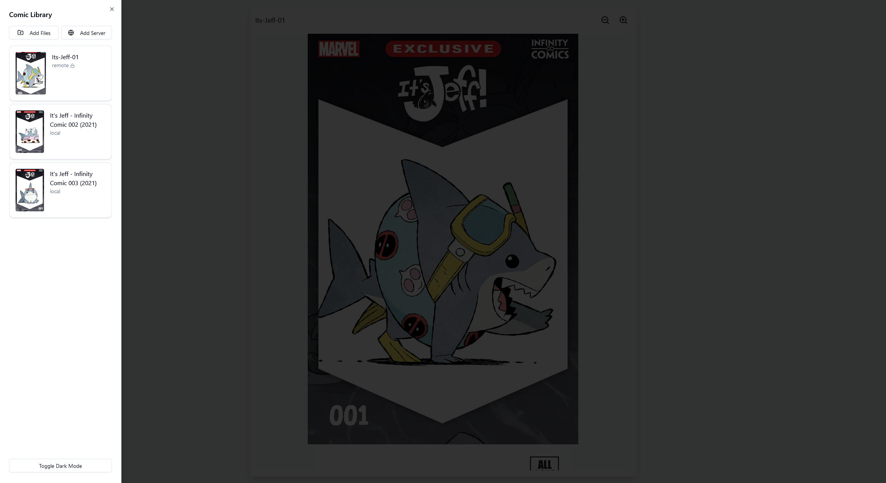
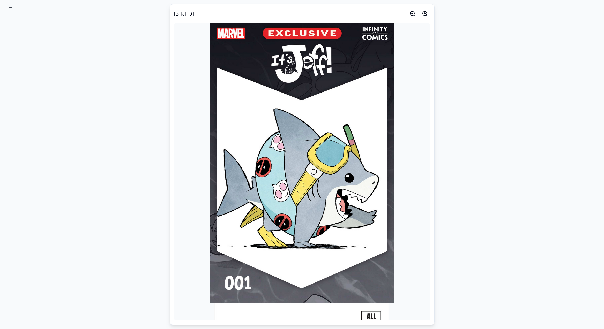

# Comic Reader 📚

<div align="center">

[](https://opensource.org/licenses/MIT)
[](https://nodejs.org/)
[](http://makeapullrequest.com)

A modern, feature-rich comic reader for CBZ files, built with React and Node.js.

[Features](#features) •
[Screenshots](#screenshots) •
[Installation](#installation) •
[Usage](#usage) •
[Contributing](#contributing)

</div>

## ✨ Features

- 📖 Smooth comic reading experience with CBZ support
- 🌙 Dark and light mode support
- 🔒 Optional password protection for servers
- 🖱️ Intuitive page navigation with scroll and arrow keys
- 🔍 Advanced zoom controls for detailed panel viewing
- 📚 Comprehensive library management system
- 🌐 Support for both local files and remote server
- 🎨 Beautiful cover image previews
- 🐳 Docker support for easy deployment

## 📸 Screenshots

### Library View (Dark Mode)

*Comic library interface with add files and server options*

### Library View (Light Mode)

*Same interface in light mode*

### Comic Reader

*Comic reading interface with zoom controls*

## 🚀 Quick Start

### Using Docker Compose

Create a `docker-compose.yml` file:

```yaml
services:
  comic-reader:
    image: ghcr.io/jackolix/comic-reader:latest
    ports:
      - "80:80"
    restart: unless-stopped

  comic-server:
    image: ghcr.io/jackolix/comic-server:latest
    volumes:
      - ./comics:/comics
    environment:
      - COMICS_DIR=/comics
      - SERVER_PASSWORD=your_secure_password #optional
      - PORT=3000 #default is 3000
    ports:
      - "3000:3000"
    restart: unless-stopped

networks:
  default:
    driver: bridge
```

Run with:
```bash
docker-compose up -d
```

### Using Docker Run

For the comic reader (frontend):
```bash
docker run -d \
  --name comic-reader \
  -p 80:80 \
  --restart unless-stopped \
  ghcr.io/jackolix/comic-reader:latest
```

For the comic server (backend):
```bash
docker run -d \
  --name comic-server \
  -v /path/to/your/comics:/comics \
  -e COMICS_DIR=/comics \
  -e SERVER_PASSWORD=your_secure_password \ #optional
  -p 3000:3000 \
  --restart unless-stopped \
  ghcr.io/jackolix/comic-server:latest
```

## 🔌 API Reference

| Endpoint | Method | Description |
|----------|--------|-------------|
| `/api/comics` | GET | List all comics |
| `/api/comics/:filename` | GET | Retrieve specific comic |
| `/api/covers/:filename` | GET | Get comic cover |
| `/api/status` | GET | Server health check |

## 🤝 Contributing

See [DEVELOPMENT.md](docs/DEVELOPMENT.md) for detailed development setup and guidelines.

## 📄 License

This project is licensed under the MIT License

## 🙏 Code Used

- [JSZip](https://stuk.github.io/jszip/) - CBZ file handling
- [shadcn/ui](https://ui.shadcn.com/) - UI components
- [Lucide](https://lucide.dev/) - Icons